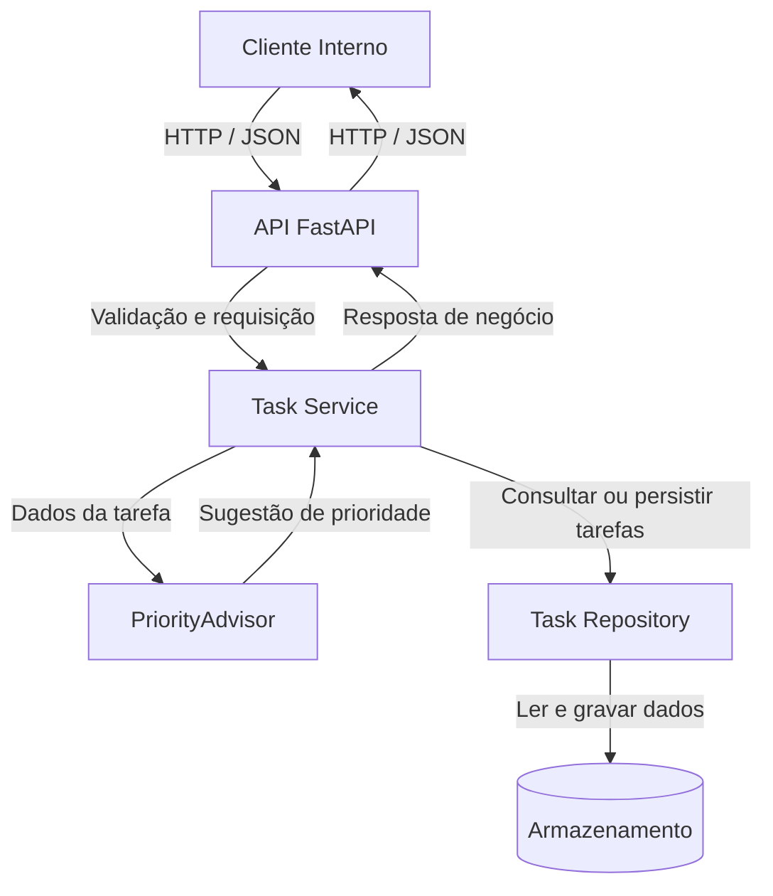

```mermaid
flowchart TD
    Client[Cliente Interno]
    API[API FastAPI]
    Service[Task Service]
    Advisor[PriorityAdvisor]
    Repository[Task Repository]
    Storage[(Armazenamento)]

    Client -->|HTTP / JSON| API
    API -->|Validação e requisição| Service
    Service -->|Consultar ou persistir tarefas| Repository
    Repository -->|Ler e gravar dados| Storage
    Service -->|Dados da tarefa| Advisor
    Advisor -->|Sugestão de prioridade| Service
    Service -->|Resposta de negócio| API
    API -->|HTTP / JSON| Client
```
